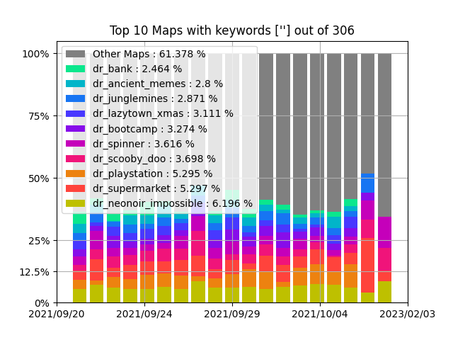

# SourceMapStats


## What is this?
A way to gather and display map relevancy for a given Source game and Gamemode.



## Usage
* Run the Write.py and start collecting data.
* The data will be stored in a output.csv file by default in the same directory.
* Once you have an Output.csv file with some data. You can view it with the Read.py.
* This will show you relevant information about the data you've just collected and generate a .png file.

## Installation
* Download and Install Python 3.10 or newer and git
* Download the repository with these comands
        
```git clone https://github.com/R60D/SourceMapStats```
```cd <path of folder>```
```git submodule update --init```
        
* Launch the install.bat to get py dependencies
* Open Parameters.py to change how the reader and writer work.

## Debugging
* Do not download the repository as a zip from github directly. Use ```git clone``` instead.

* Make sure that the python-valve folder is not empty. If it is then do this.
```cd <path of folder>```
```git submodule update --init```

* Make sure that python and pip is installed on your computer. Otherwise the installer wont work.
* Additionally make sure that your pip works by doing pip in cmd
* None Maps found?

    Change the Start and End date in the Parameters.py to reflect your desired timespan.

    Make sure that MapsToShow is not 0

    Check that your Filters are reasonable.
